# Instalación de Java
## Windows
### 1. Descargar Java
Abre la página [Java Platform (JDK) 13](https://www.oracle.com/technetwork/java/javase/downloads/index.html).

En la sección Java Platform (JDK) 13, haz click en DOWNLOAD.
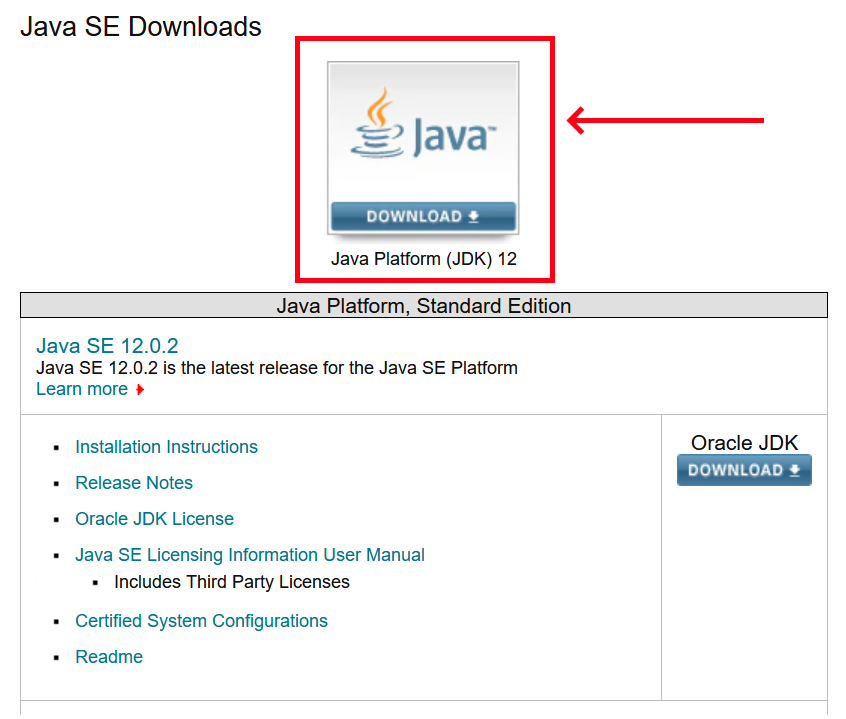

Navega hasta la parte de abajo, y selecciona la versión de `Windows`. Acepta la ligencia y elige la versión ejecutable (con terminación .exe): 
`jdk-13_windows-x64_bin.exe`
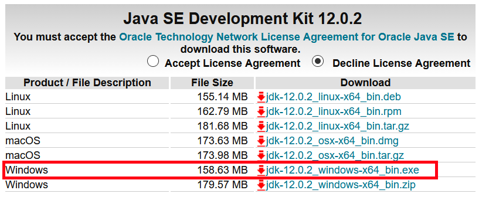

Descarga y ejecuta el archivo descargado.

### Instalación

Ejecuta el wizard.
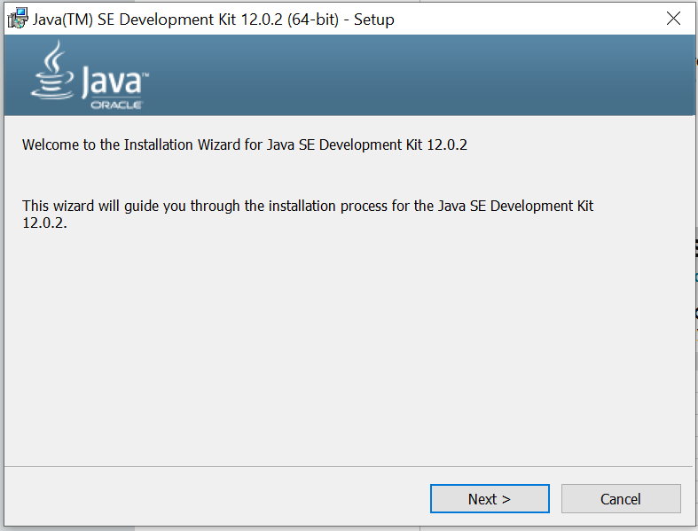

Identifica el folder en el que se está realizando la instalación. Por defecto, Java propone:
`C:\Program Files\Java\jdk-13`
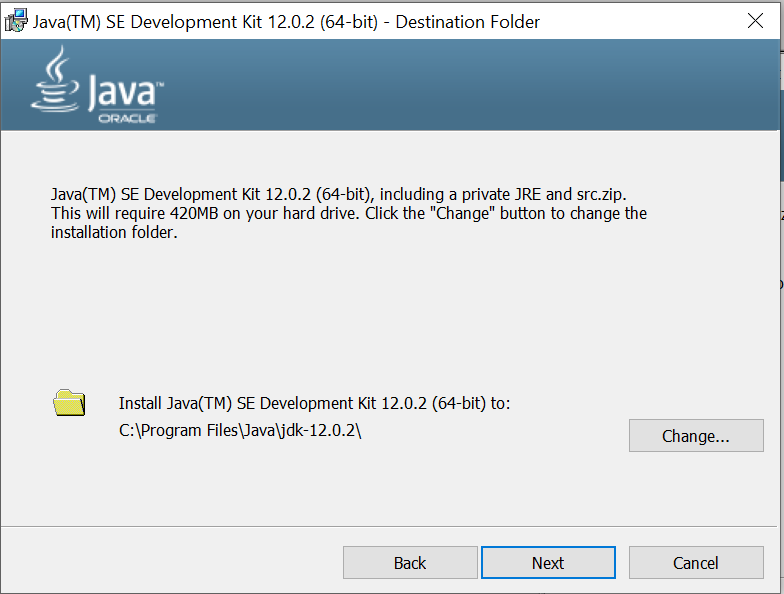

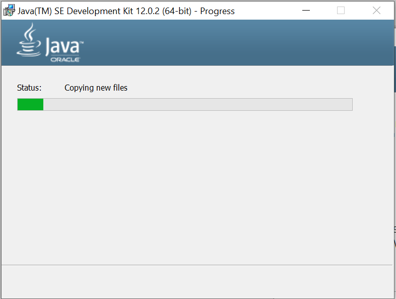
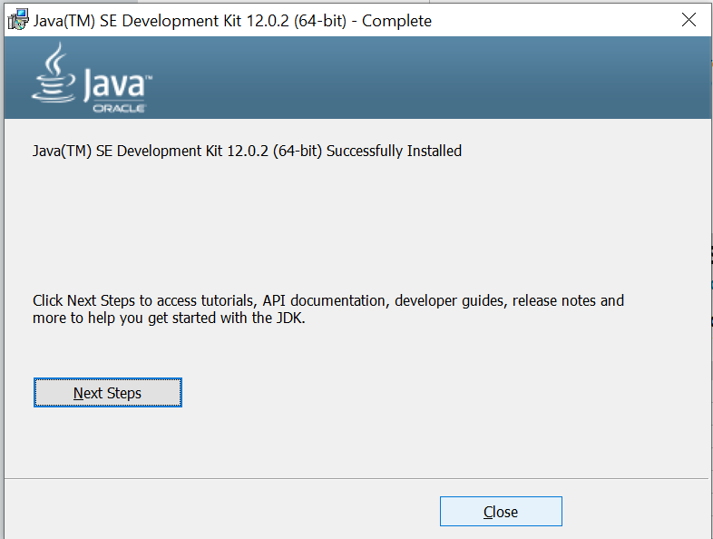

Cierra el instalador y abre `Command Prompt` haciendo click en <kbd>Win</kbd> + <kbd>R</kbd>.

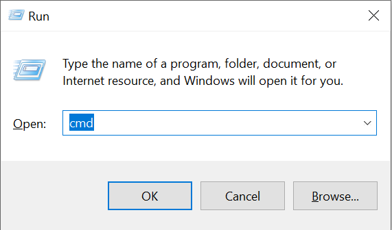

En consola, escribe la instrucción
`java`

El mensaje `'java' is not recognized as an internal or external command,
operable program or batch file.` deberá aparecer.

NOTA: En este momento Java ya está instalado y es utilizable, pero no se encuentra configurado para ser utilizado directamente a través de la línea de comandos.

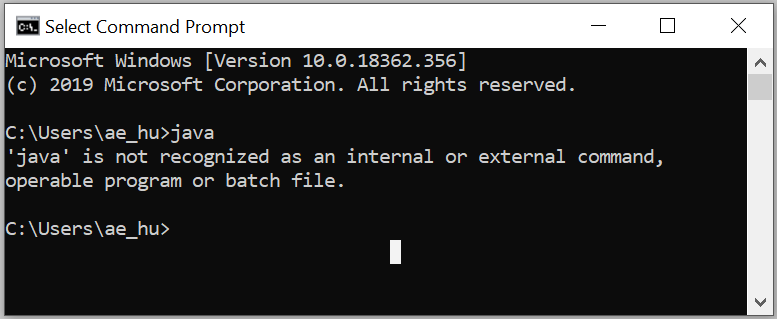

### Editar variables de entorno
En el menú Start, busca `This PC` (`Este Equipo` en español.) Haz click derecho sobre el ícono y selecciona la opción `Properties`. 

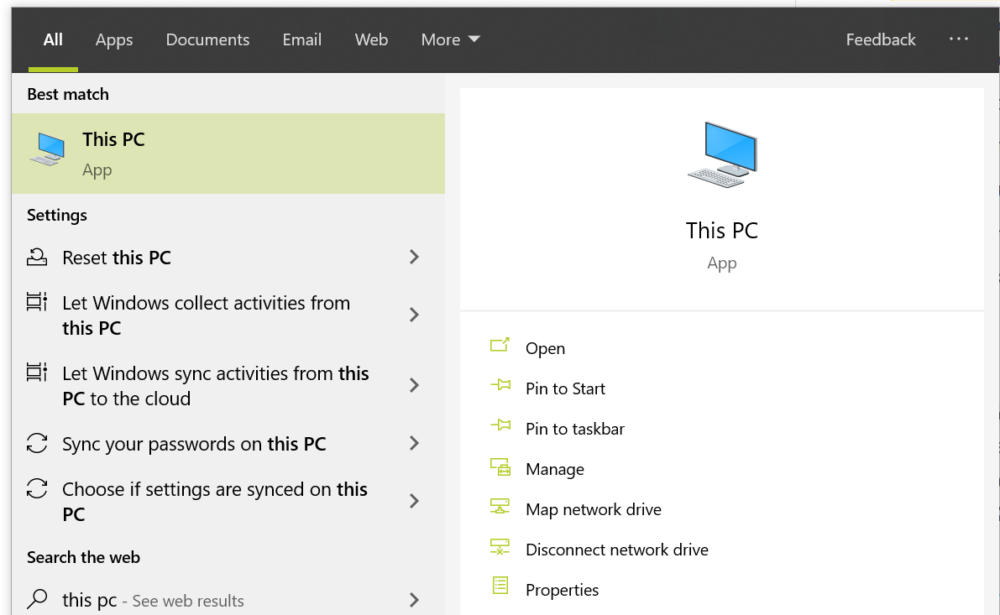

Selecciona la opción `Advanced System Settings`.
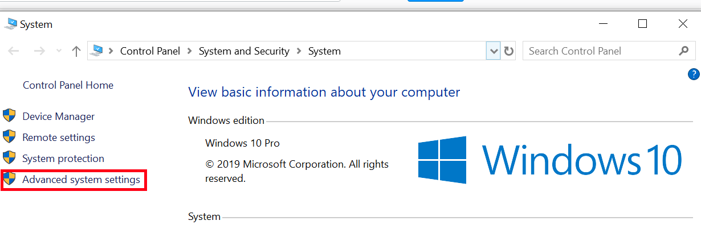

Haz click sobre `Environmental Variables...`
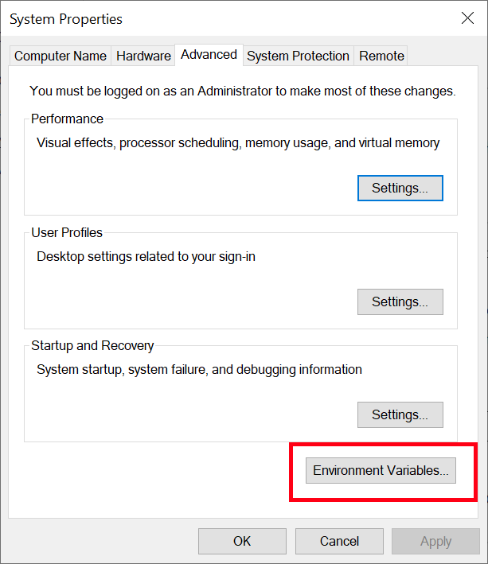

En la sección de `System variables`, selecciona `Path` y haz click sobre `Edit`.
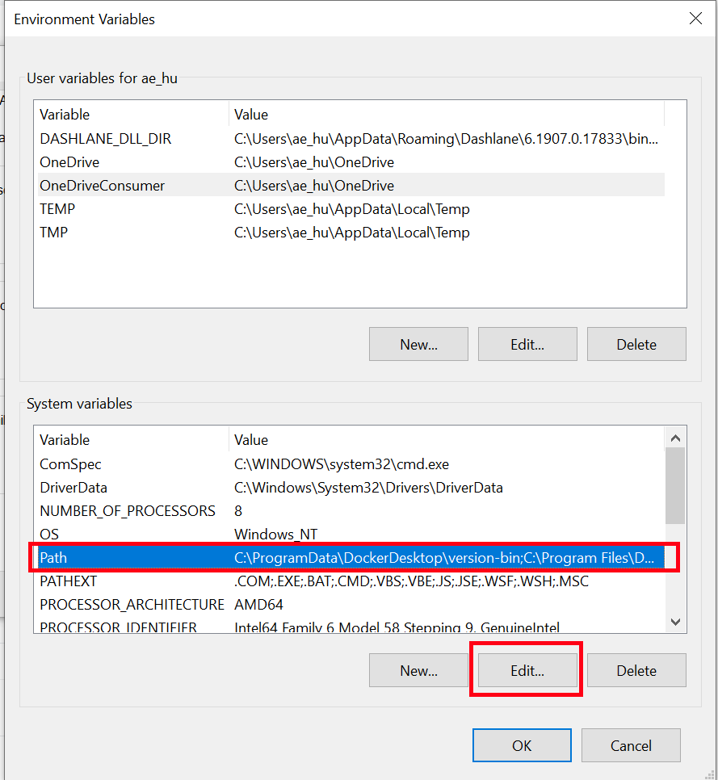

Agrega una nueva entrada en la lista de entradas haciendo click sobre `New` e insertando la ruta en donde Java está instalado, incluyendo el folder `bin`: `C:\Program Files\Java\jdk-13\bin`. **VERIFICA QUE ESTA RUTA EXISTA EN TU COMPUTADORA, pues es posible que hayas elegido una ruta distinta.**
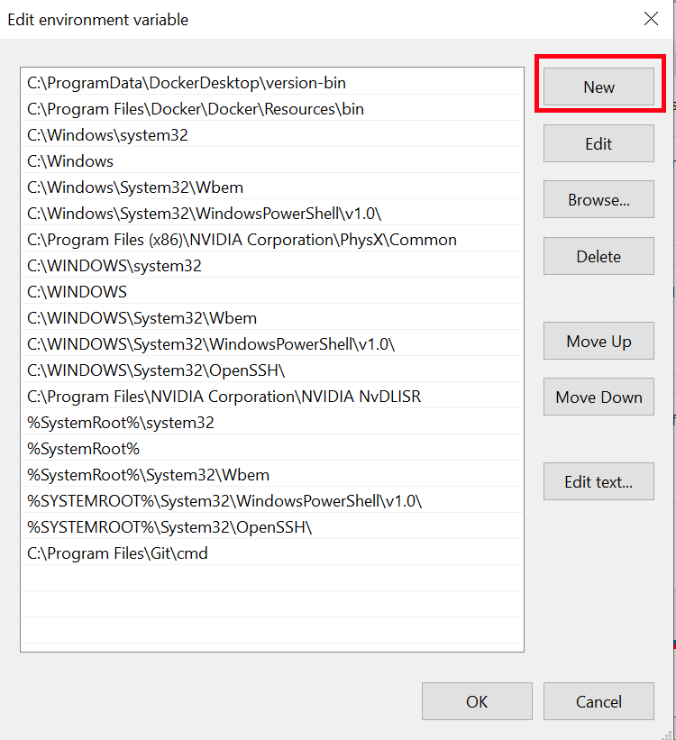

Haz click en `OK` para salir.

### Verificar instalación
Vuelve a abrir `Command Prompt` haciendo click en <kbd>Win</kbd> + <kbd>R</kbd>, e insertando la instrucción `cmd`.

En consola, escribe la instrucción
`javac -version`

La versión que elegiste al instalar la aplicación deberá aparecer aquí.
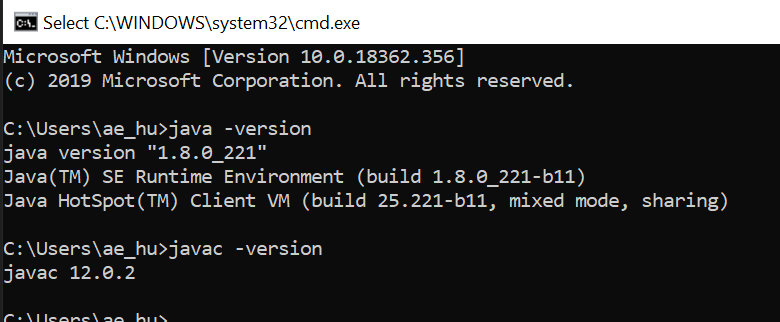

**NOTA: TOMA UN SCREENSHOT DE ESTA EVIDENCIA PARA ENTREGAR MEDIANTE BLACKBOARD.**

## Mac OS X

### ¿Necesito descargar Java?
Antes de realizar los siguientes pasos, abre una sesión de Terminal. Para esto, busca el programa el Spotlight. 
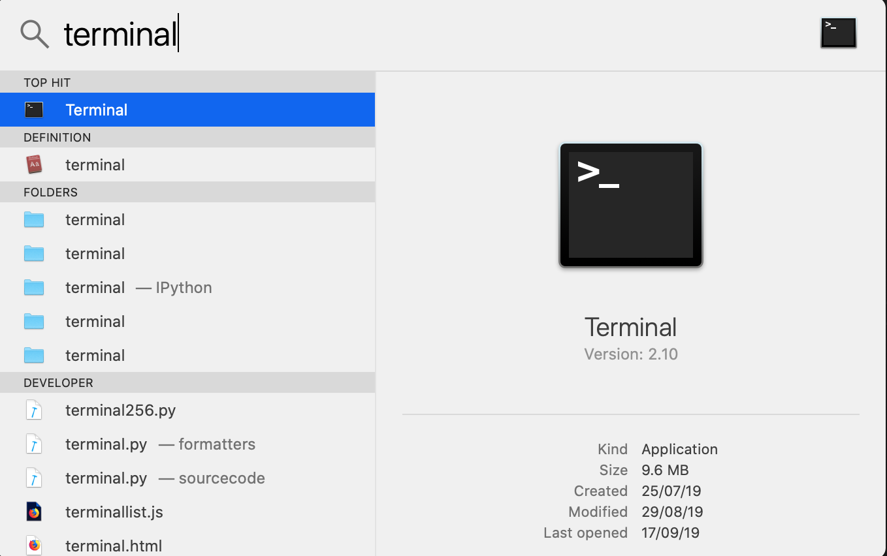

En Terminal, escribe las siguientes instrucciones:
`javac -version`

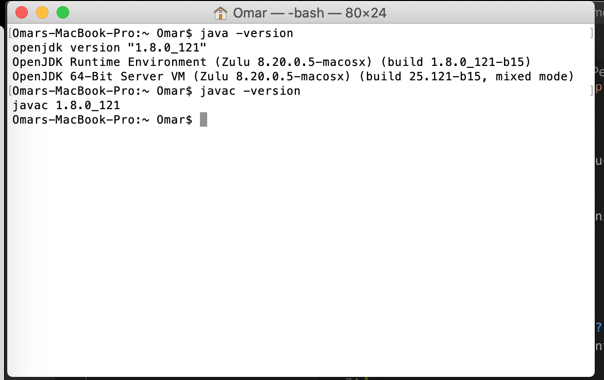

Si te muestra alguna versión de Java instalada, como OpenJDK o jdk-13, no es necesario que continúes con este proceso, pues ya tienes el Java Development Kit instalado 😉. 

### Descargar
Si no tienes Java JDK instalado, te aparecera un mensaje que te dirige hacia la página de descarga del JDK. Haz click sobre `More Info` para ir a ella.
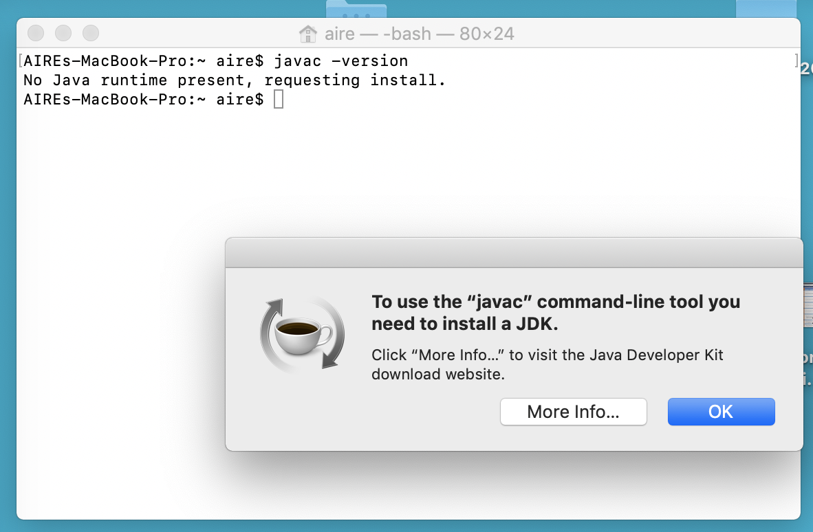

Selecciona la opción `Download` 

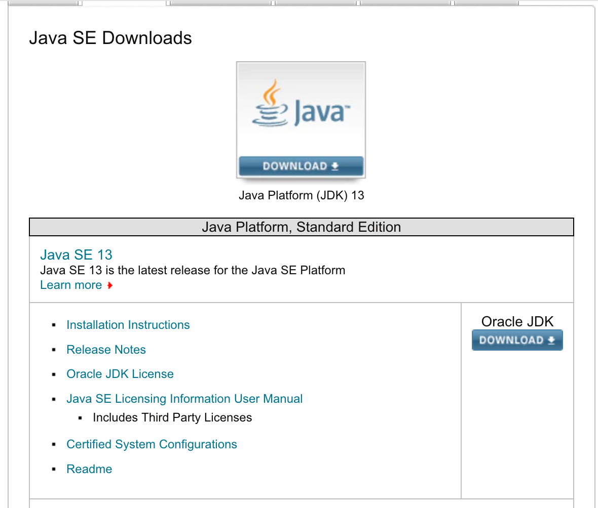

Elige la opción `jdk-13_osx-x64_bin.dmg` para Mac OS X.

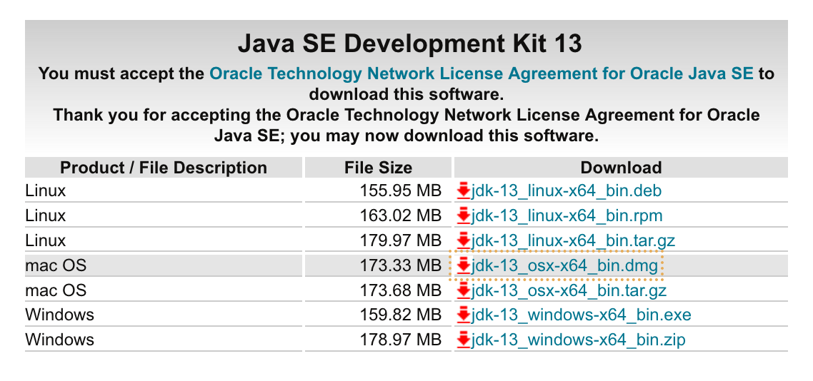

Cuando termine la descarga, abre el instalador y haz doble click sobre el archivo `JDK 13.pkg`.

Continúa con la instalación hasta terminar.

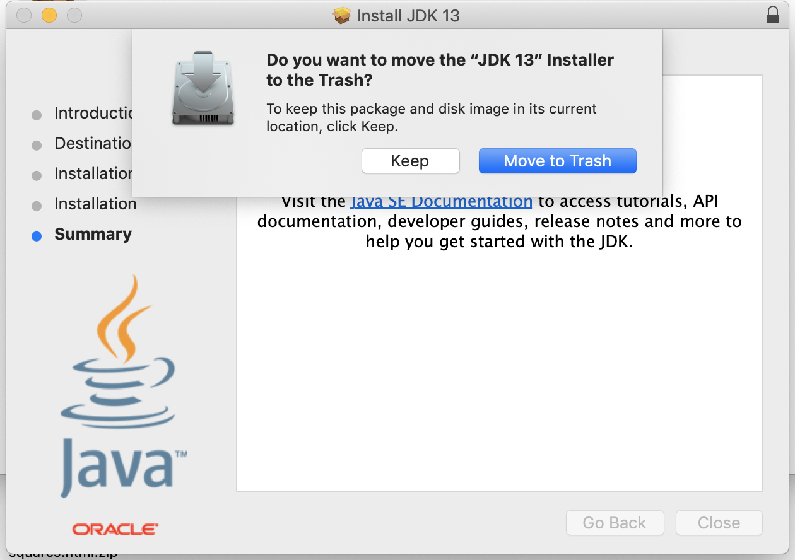

De nuevo sobre `Terminal`, ejecuta la instrucción:  
`javac -version`

La versión de Java instalada aparecerá en pantalla de la siguiente manera:

**NOTA: TOMA UN SCREENSHOT DE ESTA EVIDENCIA PARA ENTREGAR MEDIANTE BLACKBOARD.**
