# Install Progranimate

### 1. Descargar
Ve a [la página oficial de Progranimate](http://www.progranimate.com/). En el menú izquierdo, elige "Launch Progranimate".

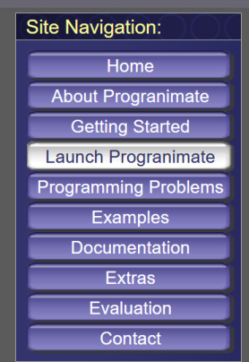

Selecciona `Java_Code` y haz click en `START`.

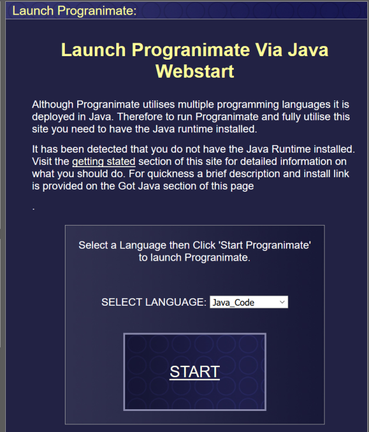

Descarga Progranimate el el directorio de tu computadora que elijas.

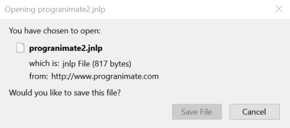

**Por el momento no ejecutaremos el archivo descargado.**

### 2. Instalacion Java Runtime Environment
> El JRE (Java Runtime Environment) es un ambiente para poder ejecutar programas codificados en Java. Contiene las librerías y máquina virtual necesaria para ejecutar programas en Java, pero no para crear programas nuevos. Una de las principales ventajas de Java es que es multiplataforma, es decir, el mismo programa de Java puede ejecutarse tanto en Windows, Mac, Linux, Android, etc.

Descarga JRE desde [la página oficial de Oracle](https://www.java.com/en/download/) y haz doble click sobre archivo descargado en tu computadora para comenzar la instalación.

> La página oficial de Oracle te detectará el sistema operativo que estás utilizando automáticamente.

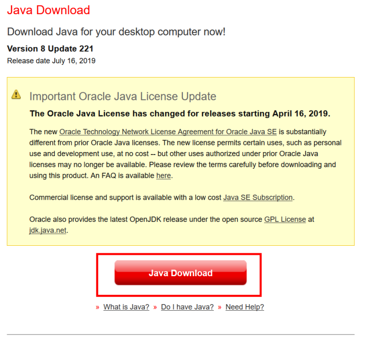
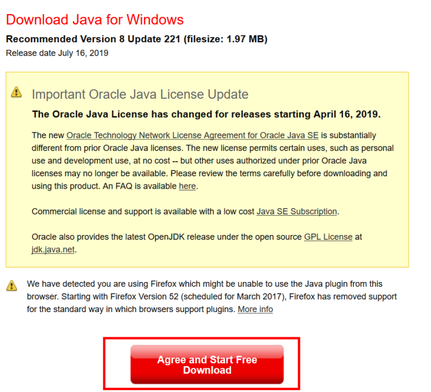
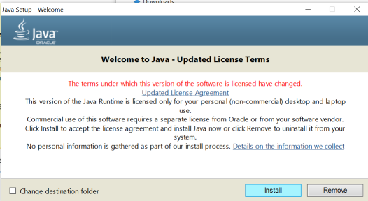
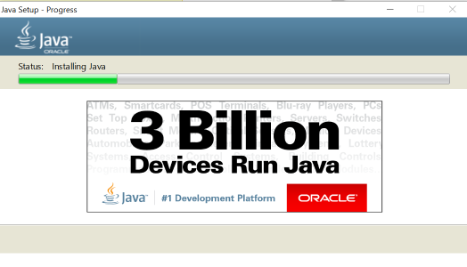

### 3. Configuración de permisos
Abre la consola de configuración de Java:

> **Windows**
> 
> Desde la barra de búsqueda, busca la opción `Configure Java`
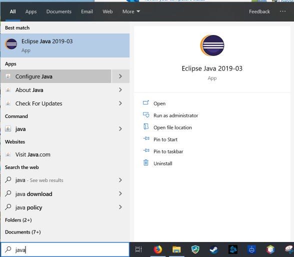

> **Mac OS X**
> 
> Abre `System Preferences`, y haz click sobre el ícono `Java`. Esto abre la pestaña adicional `Java Control Panel`.
> 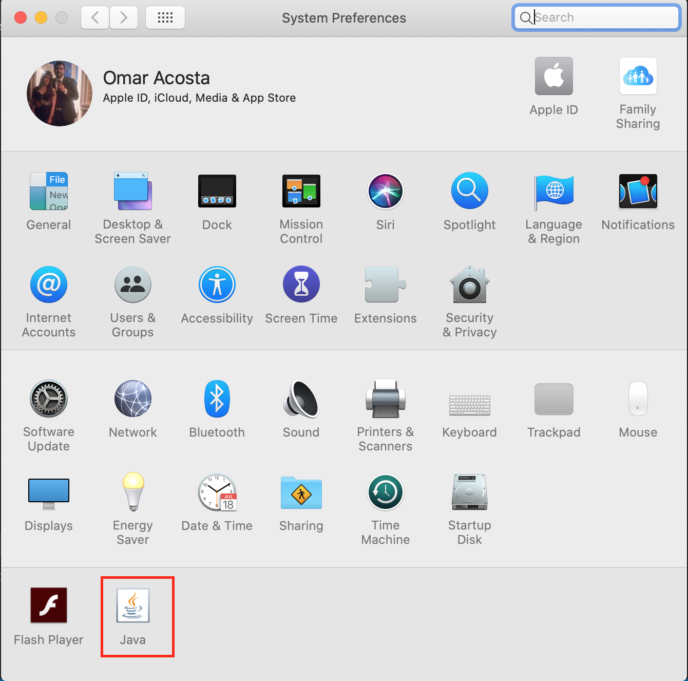

Navega a la pestaña `Security`.

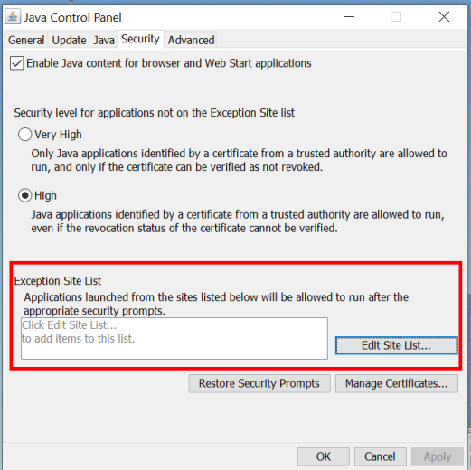

Edita la lista de sitios permitidos haciendo click sobre el botón `Edit Site List..`. Agrega la página `http://progranimate.com` y acepta.

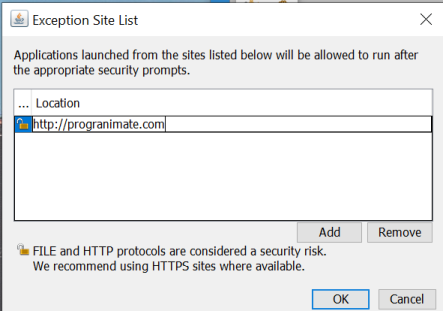

### 4. Ejecutar Progranimate
Haz doble click sobre el programa que descargamos en el paso #1 `progranimate2.jnlp`. Acepta la advertencia de seguridad y continúa.

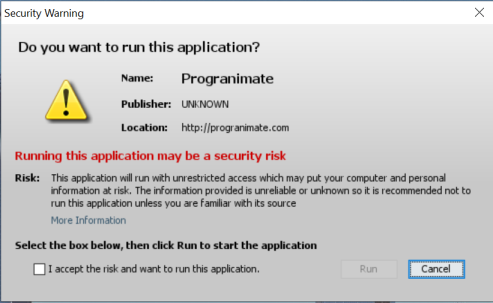

> **Mac OS X**
> Después de ejecutar Progranimate, algunas versiones de Mac OS X bloquean la ejecución directa de programas no aprobados por Apple. Como Progranimate salió antes de esta certificación, hay que especificarle al sistema operativo que queremos ejecutarlo. Para esto, abre la sección de `Security & Privacy`. Aquí, haz click en el botón `Allow`.
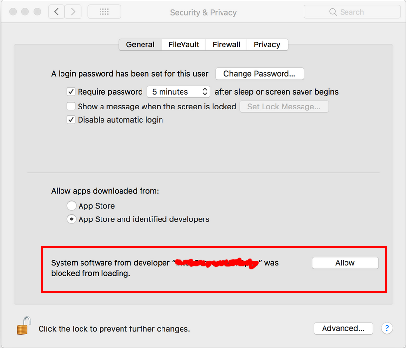

Listo! Ya puedes comenzar a utilizar el programa.

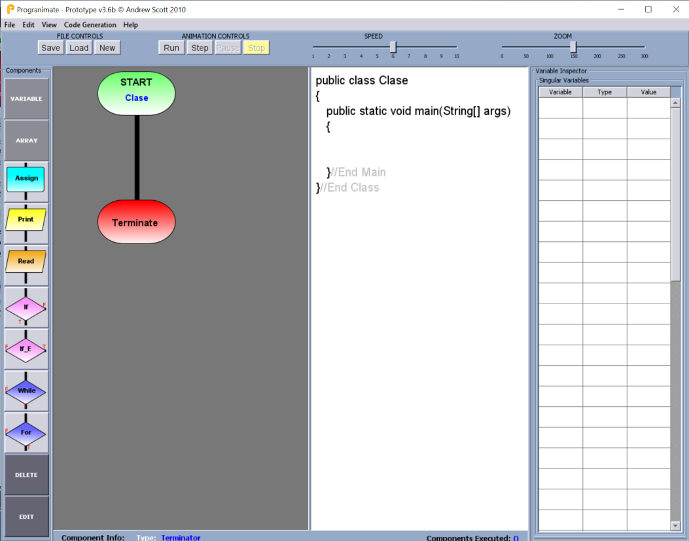

